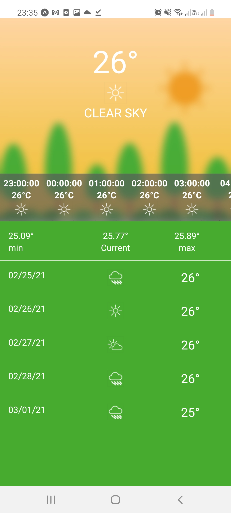

## \_React Native Assesment App

## About

This a weather application to display the current weather at the user’s location and a 5-day forecast.

#### Features

- Dynamic Background image depending on the forecast
- Dynamic and custom weather icons
- Location Based Weather feeds
- [Extra] - Pull to refresh
- [Extra] - Display hourly data
- [Extra] -Blur Background images to enhance UI

## Operating System

The application runs on the following devices

- Android
- iOS

| iOS (Simulator)                                       | Android (actual device)                               |
| ----------------------------------------------------- | ----------------------------------------------------- |
|  |  |

## Tech

The application is build using a blank expo template

- [React Native](https://reactnative.dev/docs/getting-started)
- [Expo](https://expo.io/)
- [Jest](https://jestjs.io/)
- [Enzyme](https://jestjs.io/)
- [Axios](https://jestjs.io/)

## Repository and Setup

Clone the application from [Github](https://github.com/morokolo/weather-app-assessment.git) by running git clone https://github.com/morokolo/weather-app-assessment.git

Run the following in your root directory:

```sh
weather-app-assessment
npm i or yarn
```

## Run the app

```sh
npm start or yarn start
```

## Writing and Running Tests

This project is set up to use jest for tests because it works out of the box. Tedst directories are in a directory named:

```sh
__tests__

Run yarn test
```


